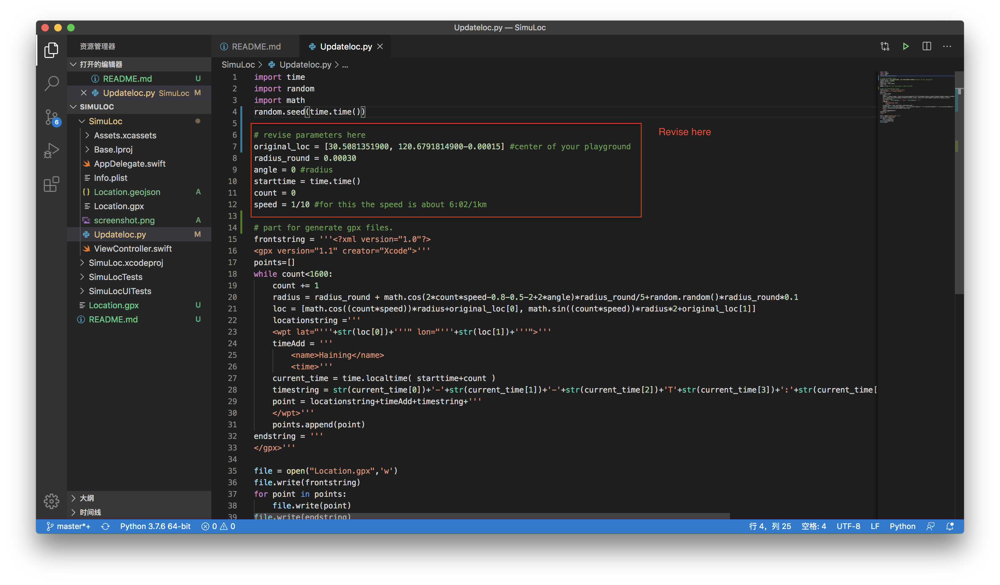
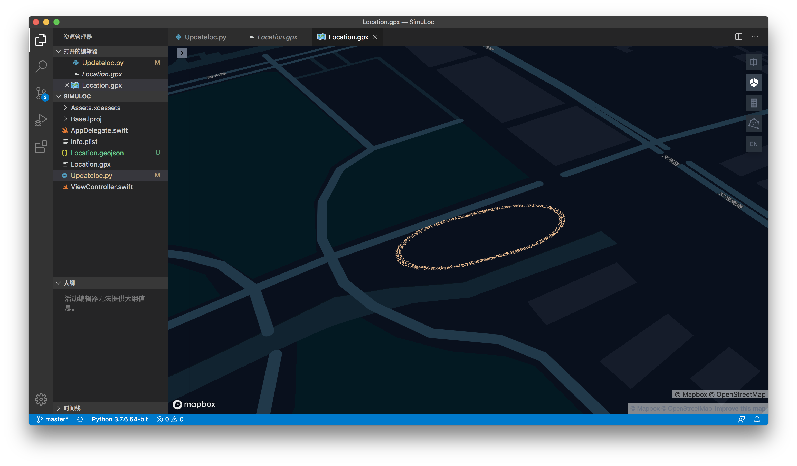
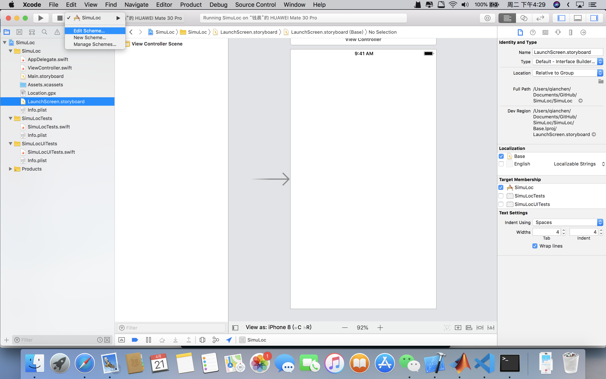
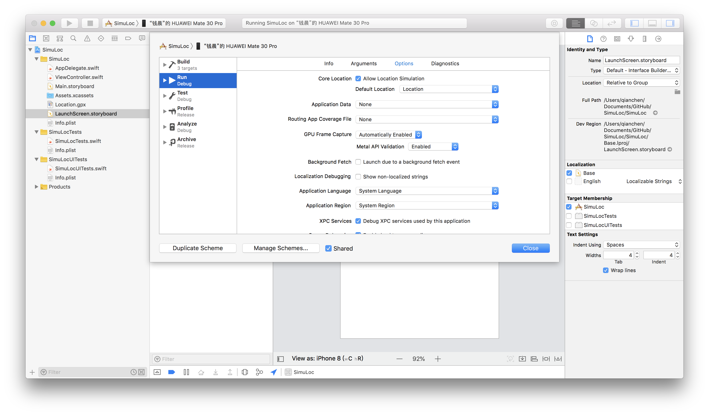
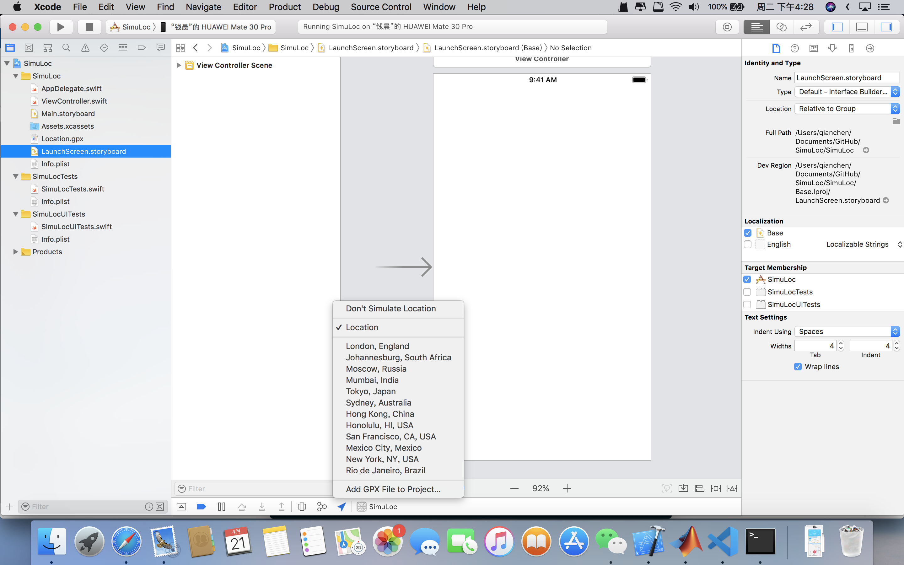
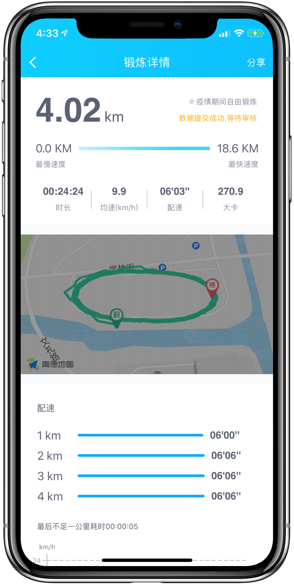

# This is a GPS mocker for iPhone

To use it, first you need to excute the Updateloc.py in SimuLoc folder. You need also revised the parameters in the parameters region to let the route fit your playground. Then the Location.gpx will be updated to your current time, also randomized the path.

## Revise the parameters

then you will get a gpx file, which contains the route you run.

Third, open the xcode project, plugin your iDevice.

Then navigate here, click on the Allow location simulation and select the 'Location'

When starting, click on the small arrow on the bottom and ensure the location is loaded.

Finally run whatever app you love.

# TODO

Slowly slow down as our sims will get tired.